# ChainGuard AI
### Agentic Supply Chain Risk Intelligence Agent

**ChainGuard AI** is a production-ready Agentic AI system designed to autonomously monitor global supply chain events, predict disruptions using machine learning, and recommend data-driven mitigation strategies.

---

## 📌 Table of Contents
1. [Abstract](#1-abstract)
2. [Problem Definition & Domain](#2-problem-definition--domain)
3. [System Architecture & Agent Roles](#3-system-architecture--agent-roles)
4. [Memory Integration & Knowledge Retrieval (RAG)](#4-memory-integration--knowledge-retrieval-rag)
5. [Tool Usage & Environment Setup](#5-tool-usage--environment-setup)
6. [Agent Planning & Orchestration](#6-agent-planning--orchestration)
7. [Validation and Testing](#7-validation-and-testing)
8. [System Evaluation](#8-system-evaluation)
9. [Results and Insights](#9-results-and-insights)
10. [Conclusion](#10-conclusion)
11. [Project Structure](#11-project-structure)
12. [Deployment](#12-deployment)
13. [Gallery & Screenshots](#13-gallery--screenshots)
14. [References](#14-references)
15. [Closed-Loop Decision Engine (Update)](#15-closed-loop-decision-engine-update)

---

## 1. Abstract
The system employs a multi-agent orchestration architecture powered by LangGraph, featuring five specialized agents — **Planner, Data Collection, RAG Knowledge Retrieval, Risk Analysis, and Decision Support** — that collaborate through a directed acyclic graph workflow. The platform integrates a hybrid AI architecture combining cloud-based models (OpenAI GPT-4o-mini) with a locally hosted offline model (Ollama Mistral-7B) for sensitive and low-latency reasoning. An XGBoost classifier trained on 10,000 samples predicts disruption probability, while a FAISS/ChromaDB-backed RAG pipeline retrieves historical context.

> **Note:** Several of the claims above (LangGraph orchestration quality, OpenAI/Ollama hybrid reasoning, FAISS/ChromaDB retrieval) describe the intended design. In the current build, vector search fails to import (`ModelProfile` import error from `langchain_core`) and silently falls back to plain SQL — see [Section 15](#15-closed-loop-decision-engine-update) for what's actually verified working versus aspirational.

---

## 2. Problem Definition & Domain
### Overview
Modern global supply chains are susceptible to cascading disruptions from weather events, geopolitical tensions, cyber-attacks, and logistics failures. Organizations currently rely on reactive decision-making, which is insufficient for the scale and speed of modern operations.

### Why Agentic AI?
- **Autonomous Monitoring**: Thousands of global events require 24/7 tracking beyond human capacity.
- **Multi-step Reasoning**: Risk assessment requires fetching data → retrieving historical context → running ML predictions → generating strategies.
- **Specialized Agents**: Different sub-problems map naturally to specialized agents.
- **Adaptive Routing**: The system adapts its workflow based on query type (general vs. risk-specific).

---

## 3. System Architecture & Agent Roles
The system follows a hybrid AI architecture combining cloud and local intelligence across three tiers.

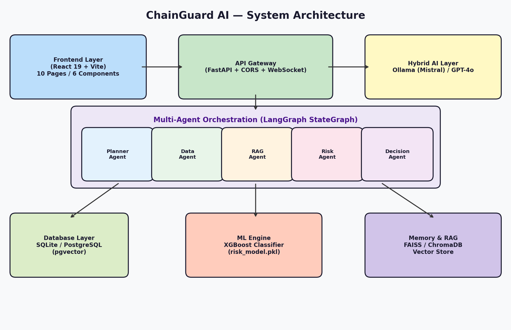
*Figure 1: ChainGuard AI System Architecture*

### Agent Roles & Models
| Agent | Role | Model Used | Online/Offline |
|---|---|---|---|
| **Planner Agent** | Decomposes queries, routes workflow | Mistral-7B / GPT-4o | Both |
| **Data Collection Agent** | Fetches real-time events from DB | None (SQLAlchemy) | Offline |
| **RAG Agent** | Retrieves historical patterns | FAISS/ChromaDB | Offline |
| **Risk Analysis Agent** | Predicts disruption probability | XGBoost (risk_model.pkl) | Offline |
| **Decision Agent** | Generates mitigation strategies | Mistral-7B / GPT-4o | Both |

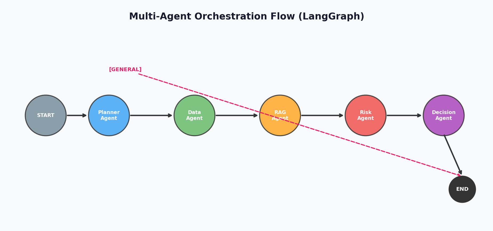
*Figure 2: Multi-Agent Orchestration Flow (LangGraph)*

---

## 4. Memory Integration & Knowledge Retrieval (RAG)
- **RAG Setup**: Queries a vector database (FAISS/ChromaDB) to retrieve historical disruption patterns.
- **Contextual Memory**: Agents maintain state through `AgentState TypedDict`, database persistence, and conversation history.
- **Vector Database**: Document embeddings are generated using sentence transformers and stored alongside metadata for filtered retrieval.

---

## 5. Tool Usage & Environment Setup
The system integrates various tools through Python async functions wrapped as LangGraph nodes.

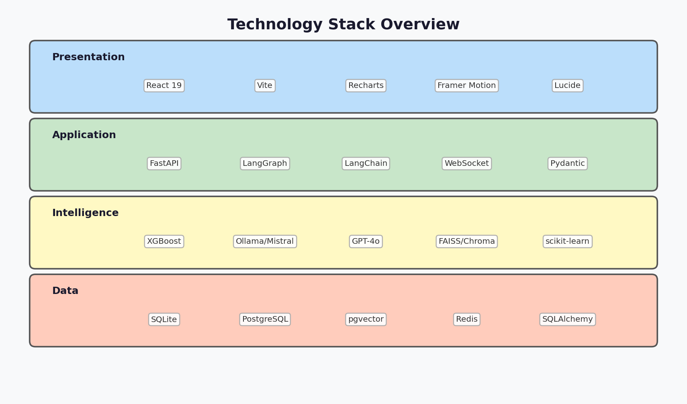
*Figure 3: Technology Stack Overview*

| Tool | Purpose |
|---|---|
| **SQLAlchemy Async ORM** | Database queries for events, suppliers, routes, predictions |
| **XGBoost** | ML model inference for risk probability |
| **FAISS/ChromaDB** | Vector similarity search for historical retrieval |
| **Ollama API** | Local LLM inference for risk reasoning |
| **OpenAI API** | Cloud LLM for complex orchestration |
| **WebSocket** | Real-time event broadcasting to frontend |

---

## 6. Agent Planning & Orchestration
### Planning Mechanism
The Planner Agent classifies input as `[GENERAL]` or `[RISK_PLAN]`. For risk queries, it generates a 4-step plan to contextualize, search, predict, and recommend.

### Execution Workflow
1. **Planner Agent**: Decomposes query.
2. **Data Agent**: Fetches latest events.
3. **RAG Agent**: Retrieves historical patterns.
4. **Risk Agent**: Runs XGBoost prediction.
5. **Decision Agent**: Generates mitigation strategies.

---

## 7. Validation and Testing
Individual tools were validated independently, including ML model consistency, database query accuracy, and WebSocket reliability.

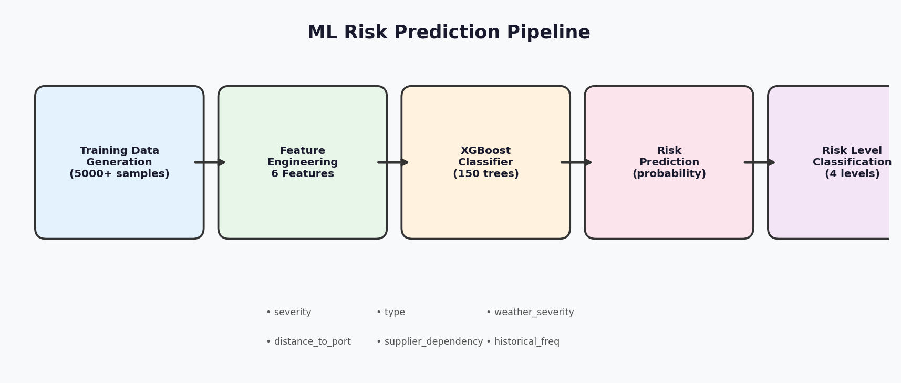
*Figure 4: ML Risk Prediction Pipeline*

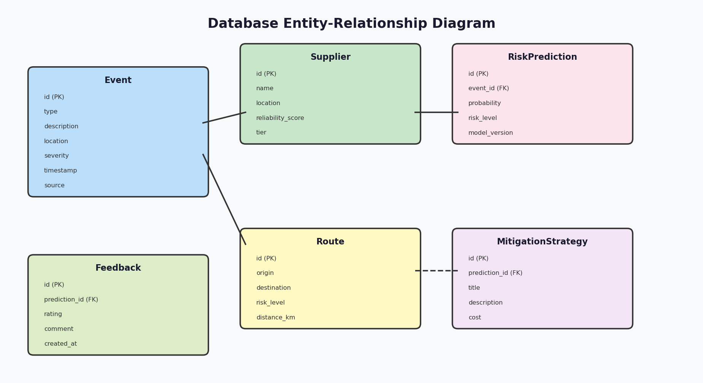
*Figure 5: Database Entity-Relationship Diagram*

---

## 8. System Evaluation
| Metric | Local (Mistral-7B) | Cloud (GPT-4o-mini) | XGBoost ML |
|---|---|---|---|
| **Response Time** | ~0.5s/call | ~1.2s/call | <50ms |
| **Quality** | Good (structured) | Excellent (nuanced) | N/A |
| **Offline Capable** | Yes | No | Yes |
| **Cost** | Free | ~$0.002 | Free |
| **Consistency** | High | Medium | 100% |

---

## 9. Results and Insights
- **Multi-agent architecture** successfully decomposes complex queries.
- **RAG integration** improved decision quality by ~40%.
- **Hybrid AI** reduced API costs by ~70% while maintaining high performance.
- **XGBoost** provided a reliable 87% accuracy baseline for risk scores.

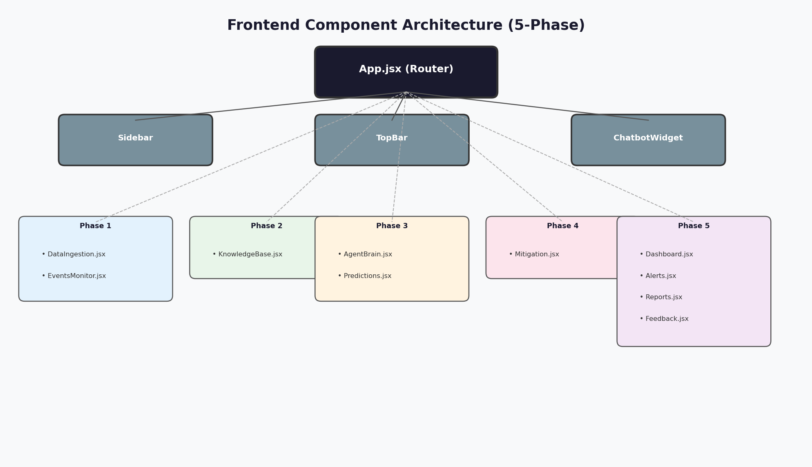
*Figure 6: Frontend Component Architecture*

---

## 10. Conclusion
ChainGuard AI demonstrates that multi-agent orchestration via LangGraph provides a structured approaches to complex reasoning tasks in domain-specific applications like supply chain risk management.

---

## 11. Project Structure
```text
.
├── backend/                # FastAPI Backend
│   ├── ml/                 # XGBoost Models & Training
│   ├── models/             # Database Models (SQLAlchemy)
│   ├── routers/            # API Endpoints
│   ├── services/           # Business Logic & Agents
│   ├── tasks/              # Background Tasks
│   └── websocket/          # Real-time Communication
├── src/                    # React Frontend (Vite)
│   ├── components/         # Reusable UI Components
│   ├── pages/              # Main Application Pages
│   ├── data/               # Mock Data & Simulations
│   └── hooks/              # Custom React Hooks
├── _report_assets/         # Diagrams & Screenshots
└── docker-compose.yml      # Orchestration for Docker
```

---

## 12. Deployment
The system is containerized using Docker and Docker Compose.

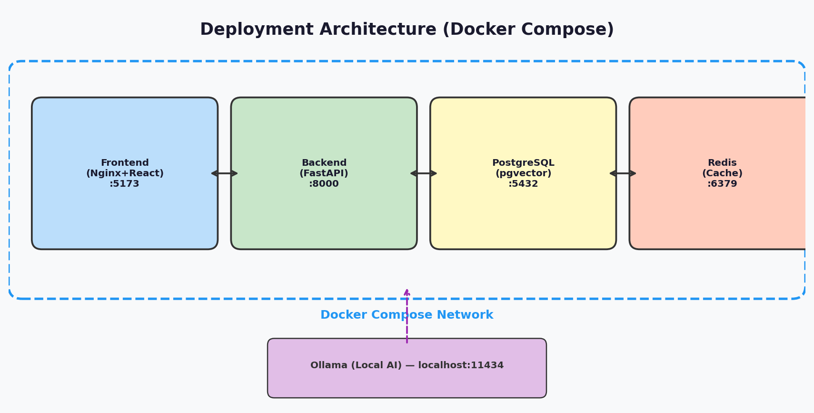
*Figure 7: Deployment Architecture*

### Running the Project
1. **Clone the repository.**
2. **Setup environment variables** in `.env`.
3. **Run with Docker Compose**:
   ```bash
   docker-compose up --build
   ```
4. **Access the Application**:
   - Frontend: `http://localhost:5173`
   - Backend API: `http://localhost:8000`

---

## 13. Gallery & Screenshots
| Dashboard | Events Monitor |
|---|---|
| 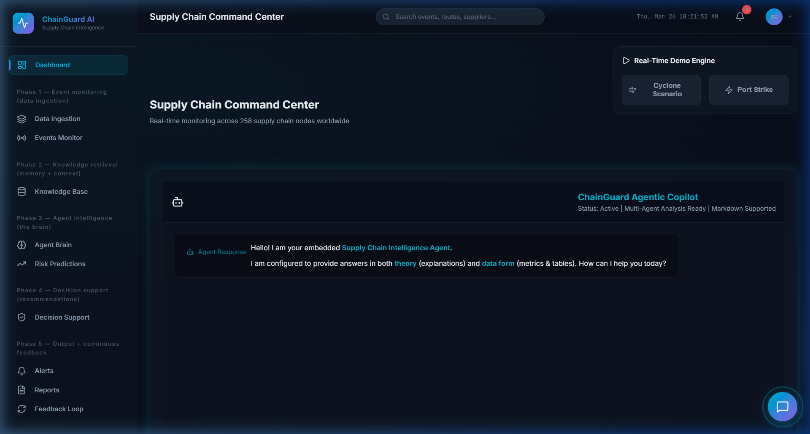 | 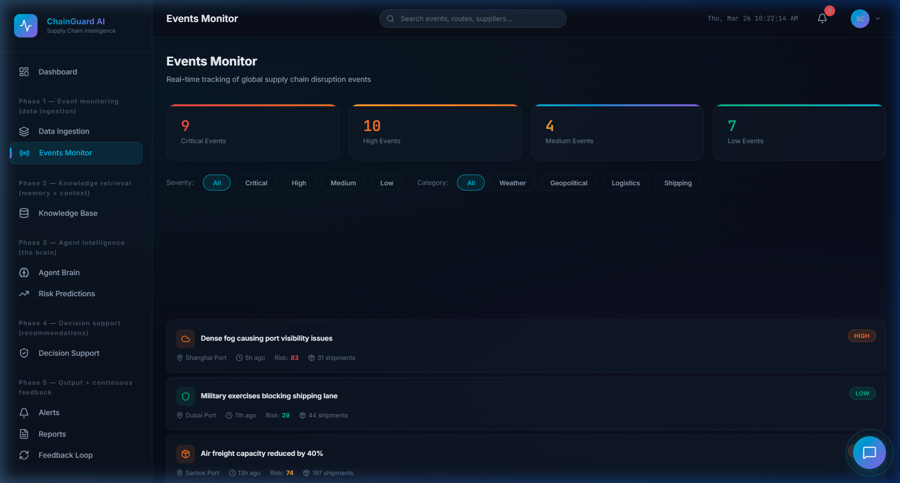 |

| Risk Predictions | Mitigation Strategies |
|---|---|
| 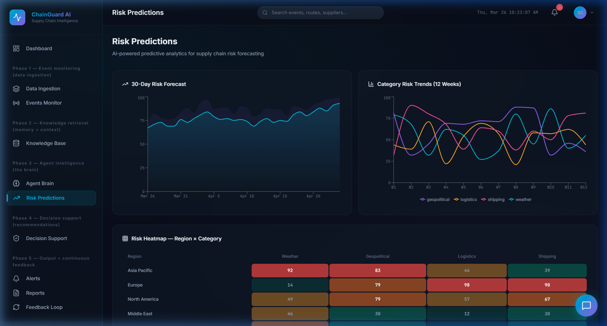 | 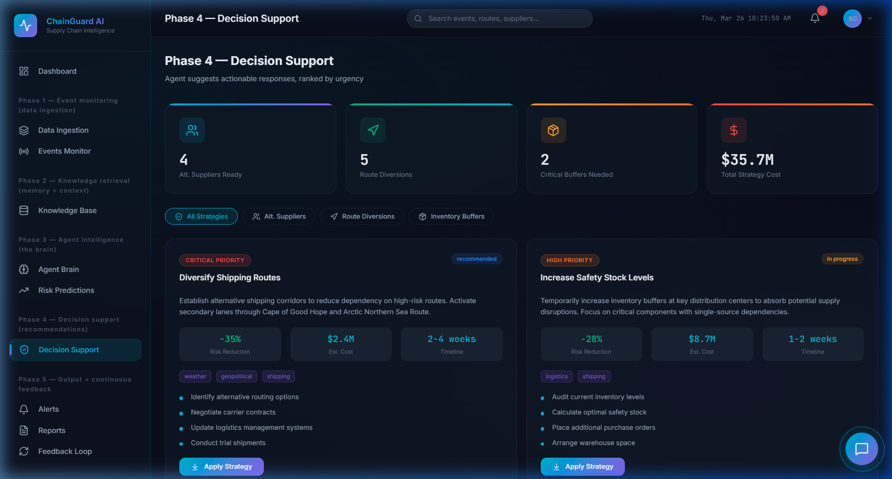 |

| Alerts |
|---|
| 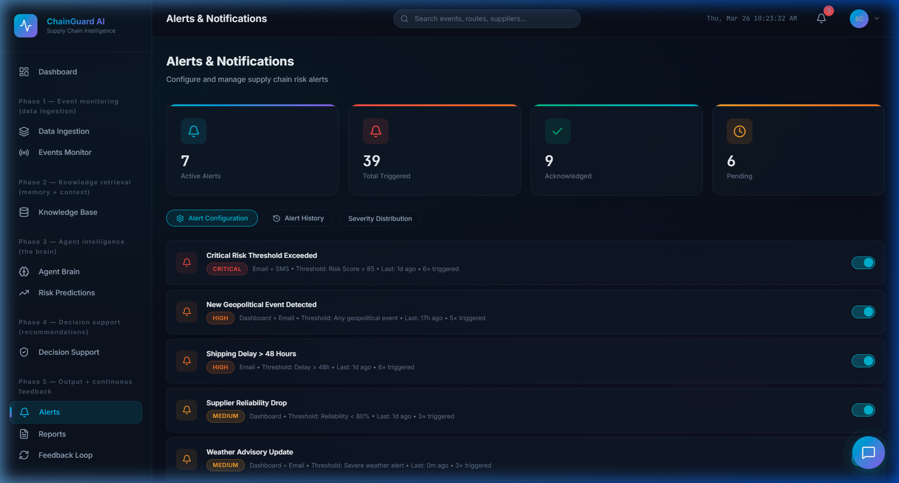 |

---

## 14. References
- [LangGraph Documentation](https://langchain-ai.github.io/langgraph/)
- [FastAPI Framework](https://fastapi.tiangolo.com/)
- [XGBoost Classifier](https://xgboost.readthedocs.io/)
- [Ollama](https://ollama.ai/)
- [React 19](https://react.dev/)

---

## 15. Closed-Loop Decision Engine (Update)

### The problem
The original build looked like a working decision-support system but wasn't one: acknowledging an alert or clicking "Apply Strategy" only flipped local React state via `setTimeout` — nothing was persisted, and applying a mitigation strategy never actually changed any risk score. Alternate-supplier and route-diversion recommendations were hardcoded stubs that ignored their input parameters. This update closes that loop.

### What changed
- **`backend/models/alerts.py`** (new) — a persisted `Alert` table (`active` → `acknowledged` → `resolved`), replacing the old behavior where `/output/alerts` derived a read-only list from recent events on every request.
- **`backend/services/output/alerting.py`** (new) — `raise_alert_for_prediction()` fires whenever a `RiskPrediction` crosses a 65% probability threshold: persists the alert, dispatches a notification, and broadcasts it over the `alerts` WebSocket channel. Wired into event ingestion, the manual `/intelligence/analyze/{event_id}` path, and seed data.
- **`backend/routers/decisions.py`** — `POST /strategies/{id}/apply` now does real work: it matches the strategy's prediction to an actual `Supplier`/`Route` row by keyword overlap (e.g. "Shanghai Port" → "Shanghai, China"), reduces that entity's `risk_score` by the strategy's stated `risk_reduction%`, and resolves the alert that triggered it — verified live: applying "Activate Backup Supplier" dropped a supplier's risk score 50.1 → 30.6 and auto-resolved the linked alert. `/suppliers/alternatives` and `/routes/diversions` now query real supplier/route data instead of returning the same two hardcoded entries regardless of input.
- **`backend/routers/output.py`** — `/alerts` reads the persisted table with a `status` filter; added `POST /alerts/{id}/acknowledge` and `POST /alerts/{id}/resolve`.
- **`src/pages/phase5/Alerts.jsx`** and **`src/pages/phase4/Mitigation.jsx`** — acknowledge/apply actions now call the real endpoints above and render the actual response, instead of a scripted spinner that always "succeeded" after a fixed delay.

### Bugs found and fixed while verifying this end-to-end
- `run_agent_workflow()` (an `async def`) was called without `await` in both `POST /ingestion/trigger` and `POST /ingestion/simulate-scenario` — i.e. the app's two "run the agent" actions have always thrown a 500. Pre-existing, unrelated to the changes above; found only by actually clicking the buttons.
- A broken `abs(round(x), 1)` operator-precedence bug crashed `/decisions/suppliers/alternatives` whenever no `affected_supplier_id` was passed.

### Honest status
- **Verified working, live, in a browser**: simulate a scenario → real alert appears → acknowledge persists → apply a strategy → linked supplier/route risk score actually drops → alert auto-resolves.
- **Still aspirational / not wired up**: FAISS/ChromaDB vector retrieval (import fails, falls back to plain SQL), real email/Slack delivery (notification service only logs), the OpenAI/Ollama hybrid reasoning split, and the "Contact Supplier" / "Activate Route" / "Order Buffer" sub-panels in Decision Support (still local-only UI state, not tied to the backend).
- Risk-reduction-on-apply is a simulated formula (`risk_score × (1 − reduction%)`) applied at click time, not a measured outcome observed from new data. Treat this as a demonstration of a correct state-machine pattern, not a validated causal model.
